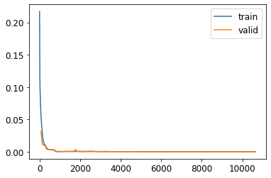

# ATLAS-Autoencoders-Evaluation

"An AE is a neural network which tries to implement an approximation to the identity, f(x) ≈ x, by using one or more hidden layers with smaller size than the input and output layers. 

The idea is then to only save this smaller hidden layer representation instead of the current data format, along with the neural network that can recreate the original data." [1]

This repository implements an Auto Encoder model to reduce the parameters stored in an experiment to 3 from 4.

### 4 Parameters:

1. *E*: energy E
2. *pt*: transverse momentum pT 
3. *eta*: pseudorapidity η 
4. *phi*: azimuthal angle φ 

### Usage:

1. Clone the repository 

```bash
$ git clone https://github.com/ShivenTripathi/ATLAS-Autoencoders-Evaluation.git
```
2. In [DatasetLoadAndClean.ipynb](DatasetLoadAndClean.ipynb), change dataset path from google drive to 'dataset'.

3. Run the notebook to generate pickled dump of cleaned and normalised dataset.

4. In [FinalTaskSolution.ipynb](FinalTaskSolution.ipynb), you will use the above pickled data for the model by removing the code cells for Google Drive.

## Procedure

### Data Loading and Cleaning

The dataset is cleaned to remove null entries. We select only objects with id jet for autoencoder model. 

From heuristics given in [dataset.pdf](dataset/dataset.pdf), we normalise each variable. 

1. *E* -> log(E)
2. *pt* -> log(pt)
3. *eta* -> eta/5
4. *phi* -> phi/3

### EDA

We generate correlation plot between variables. It is found E and pt are strongly correlated.


* Correlation Plot


    Histograms on input data:

    

    

    

    

### Preprocessing and data split

After the previous step of custom normalisation, these variables are standard normalised before being passed to the Auto Encoder. 

A 90-10-10 train,validation and test split is used for training and evaluating the model.

### Model Training

* Training Parameters

From the reference provided, ```BATCH_SIZE = 256``` is found to be optimal. 

Model is a standard AutoEncoder model, trained using FastAI. Learning Rate had been found before using ```learn.lr_find()```.


```MSELoss``` is used for its ability to represent (output-input)/input quantity well.

* Model Architecture

```
AE_3D_200_LeakyReLU(
  (en1): Linear(in_features=4, out_features=200, bias=True)
  (en2): Linear(in_features=200, out_features=200, bias=True)
  (en3): Linear(in_features=200, out_features=20, bias=True)
  (en4): Linear(in_features=20, out_features=3, bias=True)
  (de1): Linear(in_features=3, out_features=20, bias=True)
  (de2): Linear(in_features=20, out_features=200, bias=True)
  (de3): Linear(in_features=200, out_features=200, bias=True)
  (de4): Linear(in_features=200, out_features=4, bias=True)
  (tanh): Tanh()
)
```

Model is trained for 150 epochs and no overfitting is apparent yet from the training and validation loss curves.



## Results

* We impose histograms generated on test data and its predictions through the model. This is unseen data for the model and would be a very good estimate of real world performance of the system.

    

    

    

    

* Accuracy
    * Final Validation MSE Loss = ```[6.708976911795617e-07]```

    * Average Absolute Error

        ```
        For E
        Average Absolute Error is: 0.0015812253699508895
        99.8418774630049% Data was recovered


        For pt
        Average Absolute Error is: 0.0016458778389764905
        99.83541221610236% Data was recovered


        For eta
        Average Absolute Error is: 0.0014150752920233246
        99.85849247079767% Data was recovered


        For phi
        Average Absolute Error is: 0.027177307317452628
        97.28226926825474% Data was    recovered
        ```

## Error Analysis

* Pair Plots

    From this plot we can understand which variables are most likely to be erroneouly decoded, together. 

    Thankfully, the only case in which 2 variables have high residue together is of E and pt, which is expected due to their high correlation we had observed earlier.

    

* Relative Erro by bins

    From this we can know what ranges of values are toughest to decode after encoding.

    

## References

[1] [Deep autoencoders for ATLAS data compression](https://hepsoftwarefoundation.org/gsoc/2021/proposal_ATLASCompressionAE.html)

[2] [Example Model](https://github.com/ATLAS-Autoencoders-GSoC-2021/Evaluation-Exercise)

###
